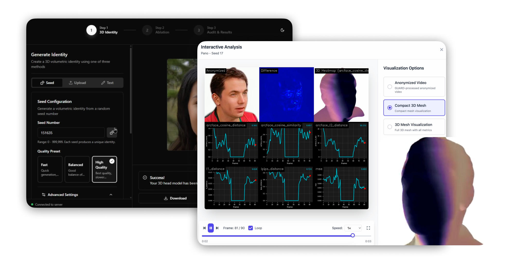
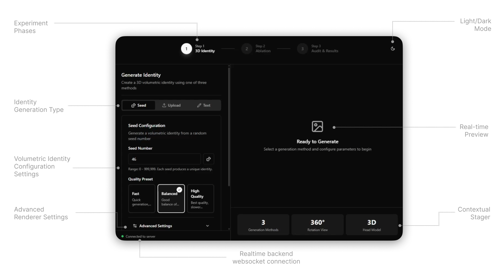
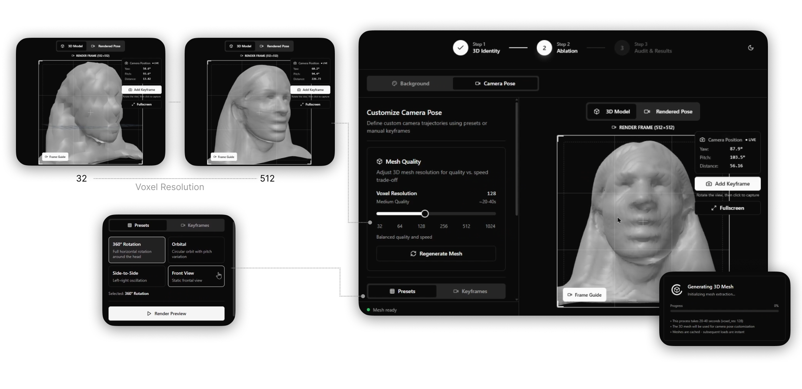
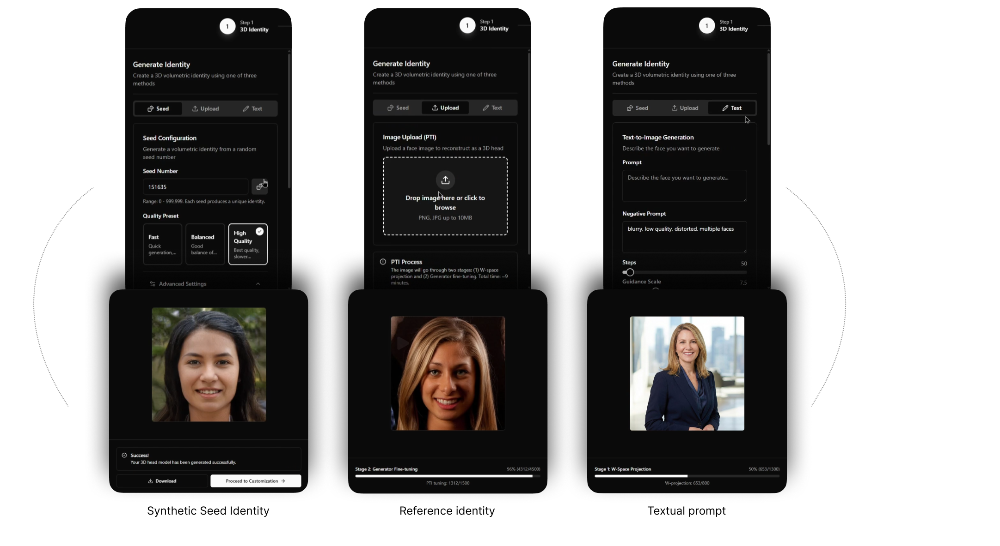
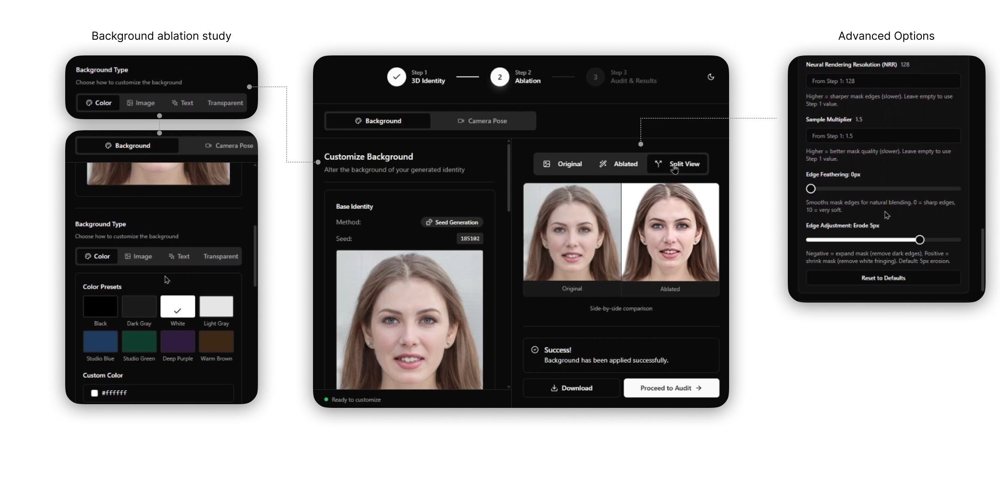
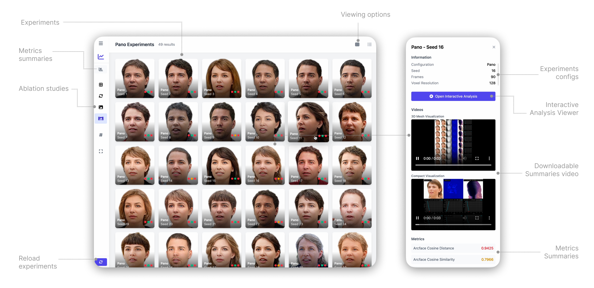
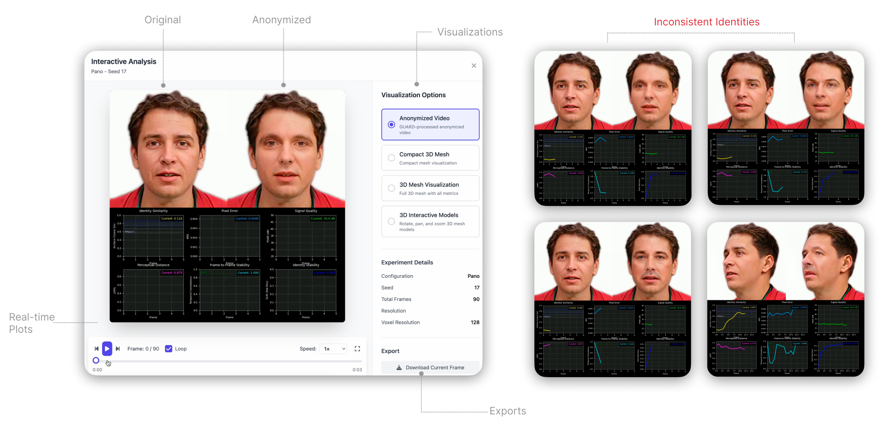
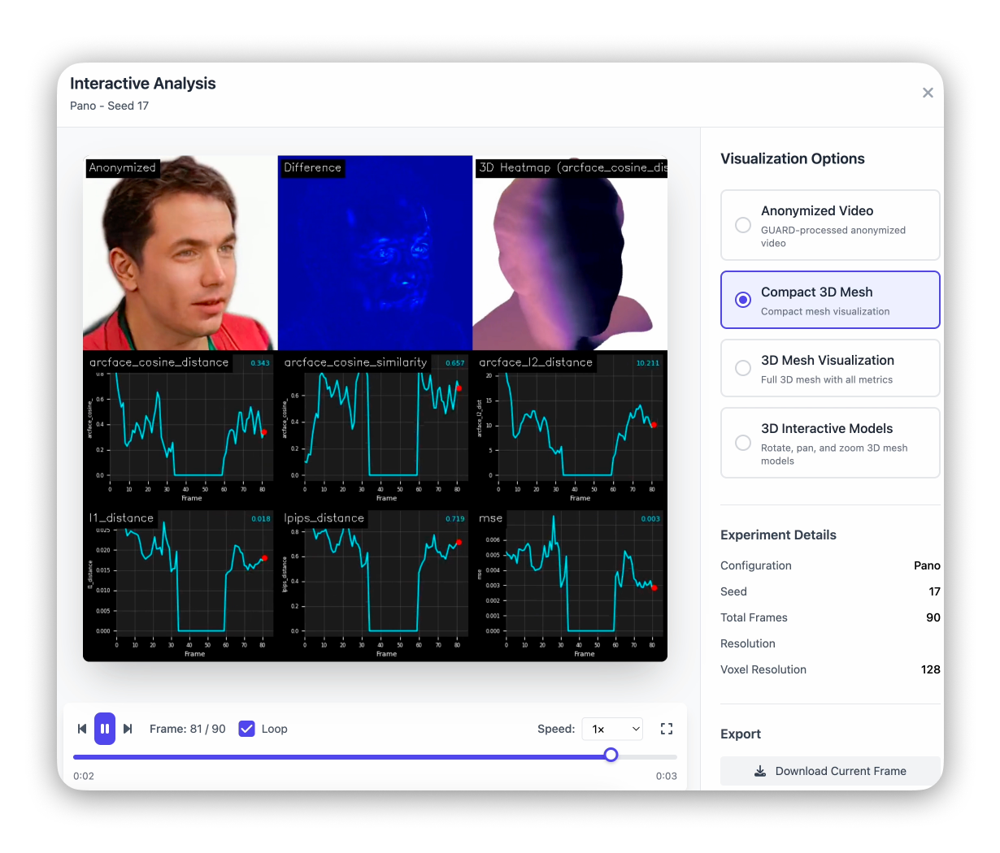

# X-DeID3D

[](https://opensource.org/licenses/Apache-2.0)
[](https://www.python.org/downloads/)
[](https://pytorch.org/)
[](https://developer.nvidia.com/cuda-toolkit)
[](https://github.com/psf/black)


<p align="center">
  
</p>

**Explainable 3D Auditing Framework for Face De-identification Systems**

X-DeID3D is a mathematically rigorous evaluation framework that provides continuous 3D explanations for face anonymization performance across viewing angles. It transforms sparse, discrete performance measurements into dense, continuous 3D heatmap visualizations using kernel regression on spherical manifolds (S²).

## Features

- **Explainable 3D Auditing**: Generate interactive 3D heatmaps showing where and how anonymization fails across viewing angles
- **Extensible Anonymizer Interface**: Plug in any face anonymization backend via the `AnonymizerProtocol`
- **Comprehensive Metrics**: Identity distance, visual quality (PSNR, SSIM, LPIPS), temporal consistency
- **Mathematical Guarantees**: Nadaraya-Watson kernel regression with LOOCV bandwidth selection
- **Modern CLI**: User-friendly command-line interface with configuration file support
- **Dual Evaluation Modes**: Population-level statistical auditing and individual-level feature attribution

## Quick Start

### Installation

```bash
# Basic installation
pip install xdeid3d

# With all optional dependencies (GUI, viewer, metrics)
pip install xdeid3d[all]

# Development installation
pip install -e ".[dev]"
```

### Download Models

X-DeID3D requires the SphereHead pretrained model for 3D head synthesis:

1. Download `spherehead-ckpt-025000.pkl` from [SharePoint](https://cuhko365-my.sharepoint.com/:u:/g/personal/223010106_link_cuhk_edu_cn/EUU4STpe1p5HhLKIYgxuN6YBWNxVKac0WCXzoDLSJPn4RA?e=pOyGkK)
2. Place it in `models/spherehead-ckpt-025000.pkl`

### Basic Usage

```bash
# Check GPU availability
xdeid3d utils check-gpu

# Generate a synthetic 3D head video
xdeid3d generate video --seeds 0-3 --output output/videos

# Evaluate with a baseline anonymizer
xdeid3d evaluate synthetic --seeds 0 --anonymizer blur --output results/

# Generate evaluation report
xdeid3d evaluate report results/ --format markdown
```

### Configuration

Create a configuration file `xdeid3d.toml`:

```toml
[synthesis]
model_path = "models/spherehead-ckpt-025000.pkl"
truncation_psi = 0.7
neural_rendering_resolution = 128

[sampling]
n_samples = 180
angular_resolution_deg = 2.0

[metrics]
enabled_metrics = ["arcface_cosine_distance", "psnr", "temporal_identity_consistency"]
primary_metric = "arcface_cosine_distance"

[anonymizer]
type = "blur"
config = { kernel_size = 51, sigma = 20.0 }
```

Then run with:

```bash
xdeid3d evaluate synthetic --config xdeid3d.toml --seeds 0-9
```

## Custom Anonymizer Integration

Implement the `AnonymizerProtocol` to integrate your own anonymization method:

```python
from xdeid3d.anonymizers import BaseAnonymizer, AnonymizerRegistry, AnonymizationResult
import numpy as np

@AnonymizerRegistry.register("my_anonymizer")
class MyAnonymizer(BaseAnonymizer):
    def __init__(self, **config):
        super().__init__(name="MyAnonymizer")
        self.config = config

    def _anonymize_single(self, image: np.ndarray, **kwargs) -> AnonymizationResult:
        # Your anonymization logic here
        anonymized = your_anonymization_function(image)
        return AnonymizationResult(anonymized_image=anonymized)
```

Then use it:

```bash
xdeid3d evaluate synthetic --anonymizer my_anonymizer --seeds 0
```

## Architecture

```
xdeid3d/
├── core/               # Mathematical foundations
│   ├── geometry/       # Spherical geometry (great-circle distance)
│   ├── regression/     # Nadaraya-Watson kernel regression, LOOCV
│   └── synthesis/      # 3D head synthesis (SphereHead)
├── anonymizers/        # Pluggable anonymizer framework
├── metrics/            # Internal metrics computation
│   ├── identity/       # ArcFace cosine distance
│   ├── quality/        # PSNR, SSIM, LPIPS
│   └── temporal/       # TIC, TVS
├── evaluation/         # Evaluation pipeline
├── visualization/      # 3D heatmap generation
├── config/             # Configuration management
├── cli/                # Command-line interface
└── api/                # REST API (viewer, GUI)
```

## Interactive Studio & Experiments Viewer

X-DeID3D includes two interactive applications for exploring 3D explanations and auditing results.

### Interactive Studio (GUI)

A real-time exploration tool for generating and analyzing 3D de-identification explanations.

<p align="center">
  
</p>

**3D Volume Visualization**: Explore identity distance heatmaps mapped onto 3D head geometry.

<p align="center">
  
</p>

**Generation Controls**: Configure synthesis parameters, sampling density, and anonymizer settings.

<p align="center">
  
</p>

**Ablation Studies**: Compare different anonymizers and parameter configurations side-by-side.

<p align="center">
  
</p>

### Experiments Viewer

A web-based dashboard for browsing batch evaluation results and comparing experiments.

<p align="center">
  
</p>

**Identity Analysis**: Detailed per-frame identity distance metrics with statistical summaries.

<p align="center">
  
</p>

**3D Color-Mapped Results**: Interactive 3D meshes with performance metrics mapped to vertex colors.

<p align="center">
  
</p>

Launch the applications:

```bash
# Interactive Studio (requires xdeid3d[gui])
xdeid3d gui

# Experiments Viewer (web-based)
xdeid3d viewer --port 5001
```

## Citation

If you use X-DeID3D in your research, please cite:

```bibtex
@misc{xdeid3d2024,
    title={X-DeID3D: Explainable 3D Auditing for Face De-identification},
    author={GUARD Project Contributors},
    year={2024},
    howpublished={\url{https://github.com/espressoshock/xdeid3d}}
}
```

## License

Apache License 2.0. See [LICENSE](LICENSE) for details.

## Acknowledgments

X-DeID3D builds on [SphereHead](https://arxiv.org/abs/2404.05680) for 3D head synthesis.
